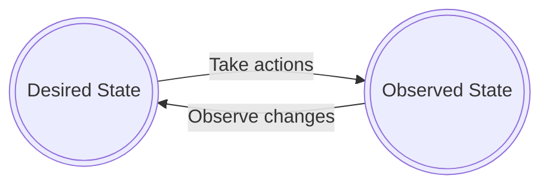

# hykube
Kubernetes control plane for hyperscaling needs.

## Project goals

The goal of the project is to rework controller management mechanisms in Kubernetes to provide more control over management of resources, to achieve management of 100,000+ nodes/resources. Close compliance with K8S is desired.

That's why the project keeps K8S API server, and it comes with a suite a additional commands to control resources synchronisation process, like [OpenTofu](https://opentofu.org/) does, with three separate steps:
1. Write - describe necessary resources, that can be K8S pods but also other resources
2. Plan - create execution plan describing infrastructure it will create, update and delete, based on the configuration and existing infrastructure
3. Apply - On approval, perform proposed operations in correct order, respecting resource dependencies

## Kubernetes limitations

Kubernetes is not handling well management of hyperscale number of resources. [As stated in the doc](https://kubernetes.io/docs/setup/best-practices/cluster-large/), for 1.30.0 version, it can support up to:
* 5,000 nodes
* 150,000 pods

Even though higher numbers are possible e.g. done by [Google](https://cloud.google.com/blog/products/containers-kubernetes/google-kubernetes-engine-clusters-can-have-up-to-15000-nodes) it's still one order of magnitude lower than hyperscale level clusters with 100,000s nodes.

### Reconciliation loop

Kubernetes synchronizes desired state to a real state via reconciliation loops:

The reason for having this automatic loop is to be able to react to dynamically changing environment. If a lost machine is detected, and it's determined pods are no longer available, the cluster tries to restore automatically to its desired state.

Within complex k8s configurations, watching mechanism on endpoints requires highest amount of resources, as [shown by OpenAI](https://openai.com/index/scaling-kubernetes-to-7500-nodes/).

Is it always necessary to follow this logic? A user do not expect having its load balancer in AWS spontaneously disappear from the infrastructure. The infrastructure is already abstracted and handles cases where underlying hardware malfunctions and Disaster Recovery failover plans may be more complicated than just this simple loop.

Because of that, it's visible that more control is needed and it should be up to end user whether such mechanism of synchronisation should be kept or not.

### Divide and conquer

[Kubernetes Cluster API](https://cluster-api.sigs.k8s.io/) is not a goal of the project as is not 

### CRDs fragmentation

Another example is issue with handling high amounts of CRDs, that cause fragmentation of libraries to handle hyperscaler' resources, e.g. Crossplane has [150+ libraries to handle AWS services](https://marketplace.upbound.io/providers/upbound/provider-family-aws/v1.10.0/providers).

## Kubernetes good parts

Unarguably, one of the best parts of the K8S is the API interface and its ecosystem, that allows building complex products. A high number of engineers is aware of `kubectl` command tool or [helm](https://helm.sh/) package manager.
