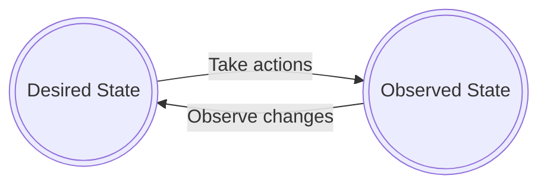
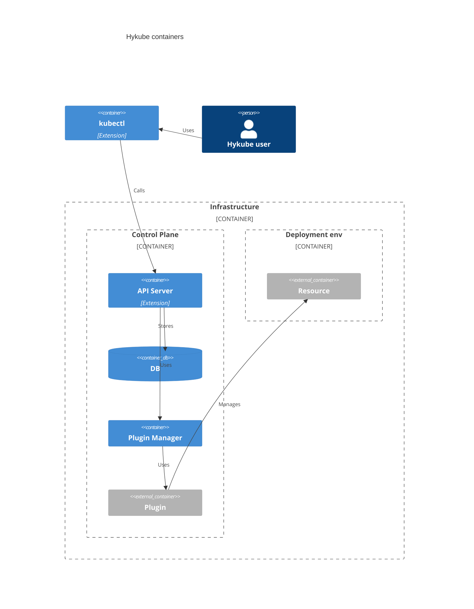

# hykube
Kubernetes control plane for hyperscaling needs.

Supports Kubernetes: **1.30**

## Project goals

The goal of the project is to rework controller management mechanisms in Kubernetes to provide more control over the management of resources, achieving control of over 100,000+ nodes/resources. Close compliance with Kubernetes (K8S) is desired.

That's why the project keeps the K8S API server and comes with a suite of additional commands to control the resource synchronization process, like [OpenTofu](https://opentofu.org/) does, with three separate steps:

1. Write: Describe necessary resources, which can be cloud resources but also other parts of an infrastructure.
2. Plan: Create an execution plan describing the infrastructure it will create, update, and delete, based on the configuration and existing infrastructure.
3. Apply: On approval, perform proposed operations in the correct order, respecting resource dependencies.

## Kubernetes limitations

Kubernetes does not handle the management of hyperscale numbers of resources well. [As stated in the documentation](https://kubernetes.io/docs/setup/best-practices/cluster-large/) for version 1.30.0, it can support up to:
* 5,000 nodes
* 150,000 pods

Even though higher numbers are possible, e.g., done by [Google](https://cloud.google.com/blog/products/containers-kubernetes/google-kubernetes-engine-clusters-can-have-up-to-15000-nodes), it's still an order of magnitude lower than hyperscale level clusters with 100,000+ nodes.

### Containerness bound

Even though containers are perceived to be the basis for modern infrastructure, K8S pods abstraction does not work well with non-container architectures like serverless or bare-metal. The project tries to abstract away the concept of pods and containers as it limits possible infrastructures it can support, especially hyperscaler ones, that can encompass VMs, bare metal with custom configuration scripts, and serverless.

### Reconciliation loop

Kubernetes synchronizes the desired state to the real state via reconciliation loops:

The reason for having this automatic loop is to be able to react to a dynamically changing environment. If a lost machine is detected, and it's determined that pods are no longer available, the cluster tries to restore automatically to its desired state.

Within complex K8S configurations, the watching mechanism on endpoints requires the highest amount of resources, as [shown by OpenAI](https://openai.com/index/scaling-kubernetes-to-7500-nodes/).

Is it always necessary to follow this logic? A user does not expect their load balancer in AWS to spontaneously disappear from the infrastructure. The infrastructure is already abstracted and handles cases where underlying hardware malfunctions, and Disaster Recovery failover plans may be more complicated than just this simple loop.

Because of that, it's visible that more control is needed and it should be up to the end-user whether such a synchronization mechanism should be kept or not.

### Divide and conquer

Even though [Kubernetes Cluster API](https://cluster-api.sigs.k8s.io/) exists and is often used to allow management of hyperscale infrastructure, the goal of the project is to be able to manage hyperscaler infrastructure with one service cluster.

### CRDs fragmentation

Another example of K8S limitations is the issue with handling high amounts of CRDs, which cause fragmentation of libraries to handle hyperscaler resources, e.g., Crossplane has [150+ libraries to handle AWS services](https://marketplace.upbound.io/providers/upbound/provider-family-aws/v1.10.0/providers).

## Kubernetes good parts

Unarguably, one of the best parts of K8S is the API interface and its ecosystem, which allows building complex products. A high number of engineers are aware of the `kubectl` command tool or [Helm](https://helm.sh/) package manager.

## High Level Architecture

## Development

Go to [local-development](./docs/local-development.md) to read more on how to perform local development.

## License

The project license is GNU AFFERO GENERAL PUBLIC LICENSE.
For details, see the GNU AGPL at: http://www.gnu.org/licenses/agpl-3.0.html
